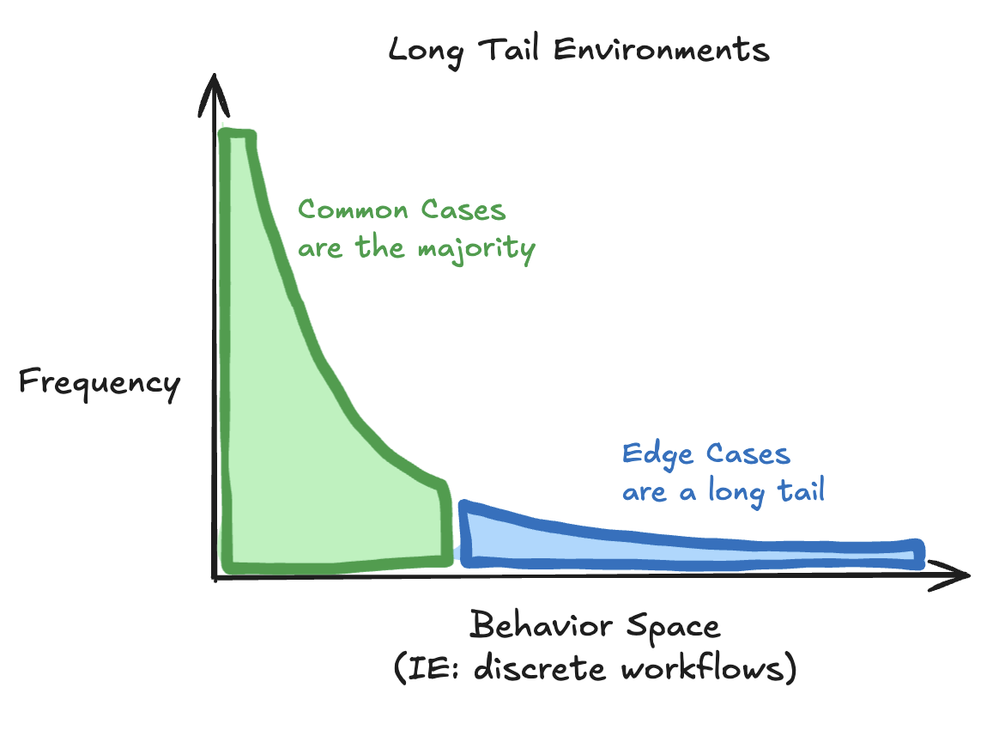
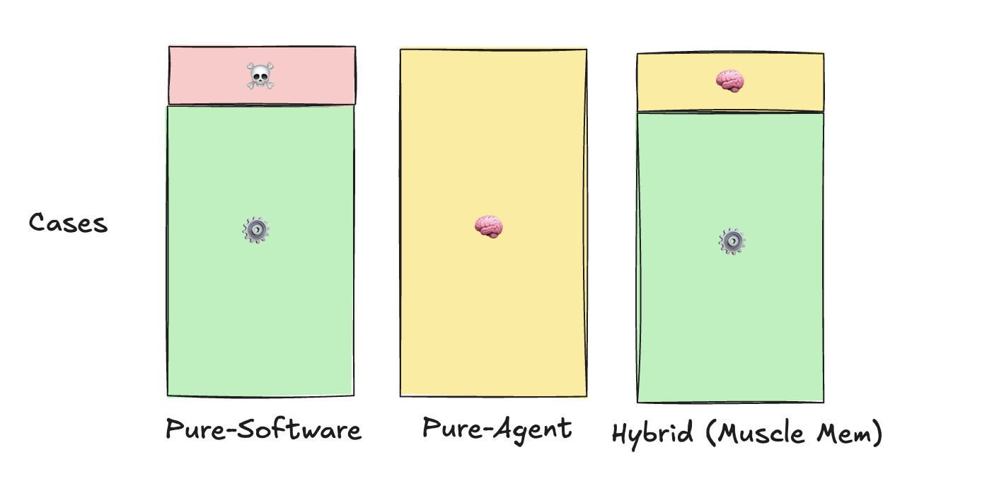

# Muscle Mem - Removing LLM calls from Agents

May 13

 
Today, I announce [Muscle Mem](https://github.com/pig-dot-dev/muscle-mem), a cache system for AI agents that allows them to learn and efficiently replay complex behaviors.

Muscle Mem records your agent's tool-calling patterns as it solves tasks, and will deterministically replay those learned trajectories whenever the task is encountered again, falling back to agent mode if edge cases are detected. Like a JIT compiler, for agent behavior.

The goal of this project is to get LLMs out of the hotpath for repetitive tasks, increasing speed, reducing variability, and eliminating token costs for the many cases that ***could have just been a script.***

Muscle Mem is [open source](https://github.com/pig-dot-dev/muscle-mem) and free to use. 

See it in action here:

[https://www.loom.com/share/5936cd9779504aa5a7dce5d72370c35d?sid=d1c31b88-43d7-4eb7-9e1e-37d67864ea21](https://www.loom.com/share/5936cd9779504aa5a7dce5d72370c35d?sid=d1c31b88-43d7-4eb7-9e1e-37d67864ea21)

## Muscle Memory as a new category

I believe this is a fundamentally new and unexplored category of tool, a “JIT Compiler” for agent behavior.

To my knowledge, `Muscle Mem` is the first in this category, though we pull inspiration from:

- The [Voyager](https://arxiv.org/abs/2305.16291) paper - definitely worth a read
- Domain-specific work done by [pig.dev](http://pig.dev) and our computer-use peers
- [JIT compilers](https://en.wikipedia.org/wiki/Just-in-time_compilation)
- [Hidden Markov Models](https://en.wikipedia.org/wiki/Hidden_Markov_model)
- [Human muscle memory](https://en.wikipedia.org/wiki/Muscle_memory)

As it’s a new space, the primary goal of this launch is to get feedback!

- Challenge assumptions made
- Critique the APIs presented
- Test the system on real use-cases

In the following blog I’ll discuss how I arrived on this problem, what I expect the core primitives to be, and what the API for those primitives would look like.

If you’d like to skip the read and jump straight to action:

1. Join the [Muscle Mem discord](https://discord.gg/s84dXDff3K) and give feedback
2. Check out [the muscle-mem repo](https://github.com/pig-dot-dev/muscle-mem), consider giving it a star

---

# Why this problem

Over the last five months at [Pig.dev](http://Pig.dev), we’ve been building computer-use agents to help teams automate repetitive tasks on legacy Windows apps, performing workflows such as form filling or data exports.

In the world of legacy app automation:

- Workflows are usually discrete; something you could teach to a human with an [SOP document](https://en.wikipedia.org/wiki/Standard_operating_procedure).
- Very little *usually* changes from workflow to workflow. These apps haven’t been updated in years.
- Unexpected change do happen, so you always need to be on your guard for edge cases like popups, slow loads, or dynamic UIs

This makes building automations a bit weird. It’s too dynamic for writing scripts, but too consistent to warrant the use of intelligence APIs.

I call this a “Long Tail Environment”.

### Long Tail Environments

A “Long Tail Environment” is an environment that is usually, but not always, predictable. 



Most real-world environments are long tail, where you can trust in laws of physics to establish some baseline predictability, but you must always be on the look out for anomalies. 

This applies in common automation modalities such as:

- computer use always has popups
- robotics always has obstacles
- voice agents always have interruptions

Unfortunately, the two options available for building automations are individually imperfect.

### Solution A: Handling all cases in code

Returning to computer-use as an example, the pure-software solution is [Robotic Process Automation](https://en.wikipedia.org/wiki/Robotic_process_automation) (”RPA”).

RPA is simply software: scripts for clicking through UIs by coordinate or element ID. All edge cases must be known in advance and handled explicitly.

In these long-tail environments, RPA works flawlessly for the 90% of common cases. It is deterministic, fast, and cheap.

The pain happens in the remaining 10%, where unhandled edge cases break the RPA, leaving the business responsible for that task not getting done. In cases such as lending, a mistake could lead to millions of dollars in liability.

It is this exact fear of edge case breakage that drove users to contact us at [Pig.dev](http://Pig.dev). They already have RPA to handle the 90%, but they need something to take them that final 10%.

### Solution B: Using agents

CUA, or Computer Use Agents, are the cool new alternative to RPA.

CUA uses AI to perform a given task by iteratively looking at screenshots and driving the mouse and keyboard until the task is complete.

By using LLMs at every single step, CUA is a perfectly dynamic system, gracefully navigating novel situations. 

But it’s this exact dynamic nature that has its flaws. It becomes incredibly expensive to use LLMs, with current models running up to $40/hr and driving UIs 5x slower than a human.

### Neither choice is perfect:

Software solutions are efficient on the 90% happy path, but breaks in the 10% edge case.

Agentic solutions are horribly inefficient in the 90% happy path, but at least they can handle the 10% edge cases.

## The hybrid solution: Muscle Memory



Muscle Memory is the logical hybridization of using software scripts and using agents. 

Similar to a JIT compiler, the ideal system takes the one-time efficiency hit of using the agent to navigate a dynamic environment, but then stores that behavior as code for reuse later.

This shifts the role of the agent to that of a precision tool, used only for the 10% of edge cases that require intelligence for for discovery, recovery, and self healing. 

Once discovered, a cached behavior can run as software, deterministically executing that trajectory during standard repeat operation.

After my time building computer-use agents, I’m convinced that the hybrid approach of Muscle Memory is the *only* viable way to offer 100% coverage on an RPA workload.

Moreover, I believe that this concept of Muscle Memory can be generalized beyond the domain of computer use, and will emerge as a fundamentally new category of tool in the software stack.

I’ve spent the last month focused exclusively on this problem, first conceptualizing what the core primitives are in a domain-agnostic Muscle Memory system, and then building the first version of it as a python SDK.

I’ve just open sourced my first stab at it:

[Muscle Mem](https://github.com/pig-dot-dev/muscle-mem)

---

# The Spec

The job of a Muscle Memory system is to:

- assess the current environment
- determine if a previously learned trajectory is valid to use (a “cache hit”)
- perform the task:
    - cache hit → execute retrieved trajectory
    - cache miss → run the agent and cache the new trajectory

### Constraints and Assumptions

It took a great deal of thought to figure out how to design `Muscle Mem` in a way that is generalizable, extensible, and stays out of your way.

Over time, I arrived at three new constraints:

**1. Bring your own agent**

I don’t want `Muscle Mem` to be yet another agent framework. The thesis of the project is to use agents as precision tool, only as needed, which means `Muscle Mem` must sit one layer below your agent and treat it as a black box.

A call to `engine(task)` should feel no different from `agent(task)` . All the engine needs to know is that it call `agent(task)`.

**2. Bring your own environment**

The read/write APIs to the environment (such as screenshot / click in computer use) are tightly coupled to your agent and domain. To generalize, `Muscle Mem` should only ever interact with these APIs through user-defined callbacks. 

**3. No hidden nondeterminism**

In my years as a developer and devtools founder, building projects such as [Banana](https://www.notion.so/Muscle-Mem-May-4-spec-1ead787b41e9803fa614e59f8dc7ab71?pvs=21) (serverless GPUs) and [Fructose](https://github.com/bananaml/fructose) (structured generation client), I’ve learned to avoid anything “automagical”.

It’s tempting to create a magical day-0 experience by patching prompts and running LLM calls behind the scenes, but this opinionation adds more reasons to churn at day-100.

`Muscle Mem` will never run nondeterministic processes, LLMs or otherwise random, except in user-defined callbacks.

**Additional assumptions made:**

- Tasks must be discrete, meaning they can be clearly named
- The environment can change mid-trajectory
- Tools given to your agent for interacting with the environment can be clearly separated between `write` operations and `read` operations.
    - A `read` tool, like `screenshot` or `get_position` should be safe to run at any time
    - All `write` tools, like `click` or `move_arm` should exclusively use data provided by the LLM’s tool call request. So no methods, no closures, no global state, no tricky ways to sneak other stateful data into that tool. Trajectories are just lists of `write` tools, and their args, so reexecuting that function in a new context with the same args should produce the same outcome.

At this point, you may be catching onto a theme:

Muscle Mem’s lack of opinionation means you need to write a lot of your own code.

So… what does Muscle Mem actually do?

### Muscle Mem does Cache Validation.

Muscle Mem does plenty of things, from tool instrumentation to storage to retrieval, but the only question that it needs to answer is:

“Given {some task} in {the current environment}, is it safe to perform this cached action?”

Imagine a muscle memory system that has no perception of the current environment. Such a system would could encounter a wildly different environment, yet blindly repeat the same exact actions as before, confidently forging forward with no idea that it’s broken. This would be no different from using scripts (like RPA).

So, the key to muscle memory isn’t just about storing actions. It’s about capturing and storing data about the environment in which those actions were taken.

### Primitives for Cache Validation

To answer the question “is it safe to perform this cached action?”, you need three things:

- data about the cached environment
- data about the current environment
- a way to compare the two and say “yes/no”

```python
capture(prev_env) -> T
...
capture(this_env) -> T
compare(this: T, prev: T) -> bool # cache hit/miss
```

This is how `Muscle Mem` works. 

It simply captures environments, and compares the current environment against a list of prior environments. 

In its simplest form, `Muscle Mem` is a database full of environments, with a filter function.

---

# The API

## Engine

The engine wraps your agent and serves as the primary executor of tasks.

It manages its own cache of previous trajectories, and determines when to invoke your agent.

```python
from muscle_mem import Engine

engine = Engine()
engine.set_agent(your_agent)

# your agent is independently callable
your_agent("do some task")

# the engine gives you the same interface, but with muscle memory
engine("do some task")
engine("do some task") # cache hit
```

## Tool

The `@engine.tool` decorator instruments action-taking tools, so their invocations are recorded to the engine.

```python
from muscle_mem import Engine

engine = Engine()

@engine.tool()
def hello(name: str):
	print(f"hello {name}!")
	
hello("world") # invocation of hello is stored, with arg name="world"
```

## Check

The Check is the fundamental building block for cache validation. They determine if it’s safe to execute a given action.

Each Check encapsulates:

- A `capture` callback to extracts relevant features from the current environment
- A `compare` callback to determines if current environment matches cached environment

```python
Check(
	capture: Callable[P, T],
  compare: Callable[[T, T], Union[bool, float]],
):
```

You can attach Checks to each tool `@engine.tool` to enforce cache validation. 

This can be done before the tool call as a precheck (also used for query time validation), or after a tool call as a postcheck. 

Below is a contrived example, which captures use of the `hello` tool, and uses timestamps and a one second expiration as the Check mechanic for cache validation.

```python
# our capture implementation, taking params and returning T
def capture(name: str) -> T:
    now = time.time()
    return T(name=name, time=now)

# our compare implementation, taking current and candidate T
def compare(current: T, candidate: T) -> bool:
    # cache is valid if happened within the last 1 second
    diff = current.time - candidate.time
    passed = diff <= 1
    return passed

# decorate our tool with a precheck
@engine.tool(pre_check=Check(capture, compare))
def hello(name: str):
    time.sleep(0.1)
    print(f"hello {name}")
```

### Putting it all together

Below is the combined script for all of the above code snippets. 

```python
from dataclasses import dataclass
from muscle_mem import Check, Engine
import time

engine = Engine()

# our "environment" features, stored in DB
@dataclass
class T:
    name: str
    time: float

# our capture implementation, taking params and returning T
def capture(name: str) -> T:
    now = time.time()
    return T(name=name, time=now)

# our compare implementation, taking current and candidate T
def compare(current: T, candidate: T) -> bool:
    # cache is valid if happened within the last 1 second
    diff = current.time - candidate.time
    passed = diff <= 1
    return passed

# decorate our tool with a precheck
@engine.tool(pre_check=Check(capture, compare))
def hello(name: str):
    time.sleep(0.1)
    print(f"hello {name}")
    
# pretend this is your agent
def agent(name: str):
   for i in range(9):
        hello(name + " + " + str(i))

engine.set_agent(agent)

# Run once
cache_hit = engine("erik")
assert not cache_hit

# Run again 
cache_hit = engine("erik")
assert cache_hit

# Break cache with a sleep, then run again
time.sleep(3)
cache_hit = engine("erik")
assert not cache_hit
```

For a more real example, see a computer-use agent implementation:

[https://github.com/pig-dot-dev/muscle-mem/blob/main/tests/cua.py](https://github.com/pig-dot-dev/muscle-mem/blob/main/tests/cua.py)

---

# Call To Action

I invite all feedback as this system develops!

Please consider:
1. Joining the [Muscle Mem discord](https://discord.gg/s84dXDff3K)
2. Testing [the muscle-mem repo](https://github.com/pig-dot-dev/muscle-mem), and giving it a star
